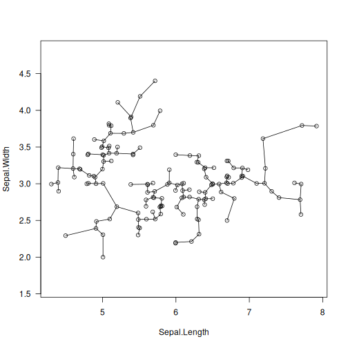

# mst_euclid: Euclidean and Mutual Reachability Minimum Spanning Trees

## Description

The function determines the/a(\*) minimum spanning tree (MST) of a set of $n$ points, i.e., an acyclic undirected graph whose vertices represent the points, and $n-1$ edges with the minimal sum of weights, given by the pairwise distances. MSTs have many uses in, amongst others, topological data analysis (clustering, dimensionality reduction, etc.).

For $M\leq 2$, we get a spanning tree that minimises the sum of Euclidean distances between the points. If $M=2$, the function additionally returns the distance to each point\'s nearest neighbour.

If $M>2$, the spanning tree is the smallest wrt the degree-M mutual reachability distance (Campello et al., 2013) given by $d_M(i, j)=\max\{ c_M(i), c_M(j), d(i, j)\}$, where $d(i,j)$ is the Euclidean distance between the $i$-th and the $j$-th point, and $c_M(i)$ is the $i$-th $M$-core distance defined as the distance between the $i$-th point and its $(M-1)$-th nearest neighbour (not including the query points themselves). In clustering and density estimation, M plays the role of a smoothing factor; see (Campello et al. 2015) and the references therein for discussion.

## Usage

``` r
mst_euclid(
  X,
  M = 1L,
  algorithm = "auto",
  max_leaf_size = 0L,
  first_pass_max_brute_size = 0L,
  mutreach_adj = -1.00000011920929,
  verbose = FALSE
)
```

## Arguments

|  |  |
|----|----|
| `X` | the \"database\"; a matrix of shape (n,d) |
| `M` | the degree of the mutual reachability distance (should be rather small, say, $\leq 20$). $M\leq 2$ denotes the ordinary Euclidean distance |
| `algorithm` | `"auto"`, `"single_kd_tree"` `"sesqui_kd_tree"`, `"dual_kd_tree"` or `"brute"`; K-d trees can only be used for d between 2 and 20 only; `"auto"` selects `"sesqui_kd_tree"` for $d\leq 20$. `"brute"` is used otherwise |
| `max_leaf_size` | maximal number of points in the K-d tree leaves; smaller leaves use more memory, yet are not necessarily faster; use `0` to select the default value, currently set to 32 for the single-tree and sesqui-tree and 8 for the dual-tree Borůvka algorithm |
| `first_pass_max_brute_size` | minimal number of points in a node to treat it as a leaf (unless it\'s actually a leaf) in the first iteration of the algorithm; use `0` to select the default value, currently set to 32 |
| `mutreach_adj` | adjustment for mutual reachability distance ambiguity (for $M>2$) whose fractional part should be close to 0: values in $(-1,0)$ prefer connecting to farther NNs, values in $(0, 1)$ fall for closer NNs (which is what many other implementations provide), values in $(-2,-1)$ prefer connecting to points with smaller core distances, values in $(1, 2)$ favour larger core distances; see above for more details |
| `verbose` | whether to print diagnostic messages |

## Details

(\*) We note that if there are many pairs of equidistant points, there can be many minimum spanning trees. In particular, it is likely that there are point pairs with the same mutual reachability distances. To make the definition less ambiguous (albeit with no guarantees), internally, the brute-force algorithm relies on the adjusted distance: $d_M(i, j)=\max\{c_M(i), c_M(j), d(i, j)\}+\varepsilon d(i, j)$ or $d_M(i, j)=\max\{c_M(i), c_M(j), d(i, j)\}-\varepsilon \min\{c_M(i), c_M(j)\}$, where $\varepsilon$ is close to 0. \|`mutreach_adj`\|\<1 selects the former formula (ε=`mutreach_adj`) whilst 1\<\|`mutreach_adj`\|\<2 chooses the latter (ε=`mutreach_adj`±1). For the K-d tree-based methods, on the other hand, `mutreach_adj` indicates the preference towards connecting to farther/closer points wrt the original metric or having smaller/larger core distances if a point $i$ has multiple nearest-neighbour candidates $j'$, $j''$ with $c_M(i) \geq \max\{d(i, j'),  c_M(j')\}`$ and $c_M(i) \geq \max\{d(i, j''),  c_M(j'')\}`$. Generally, the smaller the `mutreach_adj`, the more leaves there will be in the tree (note that there are only four types of adjustments, though).

The implemented algorithms, see the `algorithm` parameter, assume that `M` is rather small; say, $M \leq 20$.

Our implementation of K-d trees (Bentley, 1975) has been quite optimised; amongst others, it has good locality of reference (at the cost of making a copy of the input dataset), features the sliding midpoint (midrange) rule suggested by Maneewongvatana and Mound (1999), node pruning strategies inspired by some ideas from (Sample et al. ,2001), and a couple of further tuneups proposed by the current author.

The \"single-tree\" version of the Borůvka algorithm is naively parallelisable: in every iteration, it seeks each point\'s nearest \"alien\", i.e., the nearest point thereto from another cluster. The \"dual-tree\" Borůvka version of the algorithm is, in principle, based on (March et al., 2010). As far as our implementation is concerned, the dual-tree approach is often only faster in 2- and 3-dimensional spaces, for $M\leq 2$, and in a single-threaded setting. For another (approximate) adaptation of the dual-tree algorithm to the mutual reachability distance, see (McInnes and Healy, 2017).

The \"sesqui-tree\" variant (by the current author) is a mixture of the two approaches: it compares leaves against the full tree. It is usually faster than the single- and dual-tree methods in very low dimensional spaces and usually not much slower than the single-tree variant otherwise.

Nevertheless, it is well-known that K-d trees perform well only in spaces of low intrinsic dimensionality (a.k.a. the \"curse\"). For high `d`, the \"brute-force\" algorithm is recommended. Here, we provided a parallelised (see Olson, 1995) version of the Jarník (1930) (a.k.a. Prim (1957) or Dijkstra) algorithm, where the distances are computed on the fly (only once for `M<=2`).

The number of threads used is controlled via the `OMP_NUM_THREADS` environment variable or via the [`omp_set_num_threads`](omp.md) function at runtime. For best speed, consider building the package from sources using, e.g., `-O3 -march=native` compiler flags.

## Value

A list with two (M=1) or four (M\>1) elements, `mst.index` and `mst.dist`, and additionally `nn.index` and `nn.dist`.

`mst.index` is a matrix with $n-1$ rows and `2` columns, whose rows define the tree edges.

`mst.dist` is a vector of length `n-1` giving the weights of the corresponding edges.

The tree edges are ordered w.r.t. weights nondecreasingly, and then by the indexes (lexicographic ordering of the `(weight, index1, index2)` triples). For each `i`, it holds `mst_ind[i,1]<mst_ind[i,2]`.

`nn.index` is an `n` by `M-1` matrix giving the indexes of each point\'s nearest neighbours. `nn.dist` provides the corresponding distances.

## Author(s)

[Marek Gagolewski](https://www.gagolewski.com/)

## References

V. Jarník, O jistém problému minimálním, *Práce Moravské Přírodovědecké Společnosti* 6, 1930, 57--63.

C.F. Olson, Parallel algorithms for hierarchical clustering, Parallel Computing 21(8), 1995, 1313--1325.

R. Prim, Shortest connection networks and some generalizations, *The Bell System Technical Journal* 36(6), 1957, 1389--1401.

O. Borůvka, O jistém problému minimálním, *Práce Moravské Přírodovědecké Společnosti* 3, 1926, 37--58.

W.B. March, R. Parikshit, A.G. Gray, Fast Euclidean minimum spanning tree: Algorithm, analysis, and applications, *Proc. 16th ACM SIGKDD Intl. Conf. Knowledge Discovery and Data Mining (KDD \'10)*, 2010, 603--612.

J.L. Bentley, Multidimensional binary search trees used for associative searching, *Communications of the ACM* 18(9), 509--517, 1975, [doi:10.1145/361002.361007](https://doi.org/10.1145/361002.361007).

S. Maneewongvatana, D.M. Mount, It\'s okay to be skinny, if your friends are fat, *4th CGC Workshop on Computational Geometry*, 1999.

N. Sample, M. Haines, M. Arnold, T. Purcell, Optimizing search strategies in K-d Trees, *5th WSES/IEEE Conf. on Circuits, Systems, Communications & Computers* (CSCC\'01), 2001.

R.J.G.B. Campello, D. Moulavi, J. Sander, Density-based clustering based on hierarchical density estimates, *Lecture Notes in Computer Science* 7819, 2013, 160--172. [doi:10.1007/978-3-642-37456-2_14](https://doi.org/10.1007/978-3-642-37456-2_14).

R.J.G.B. Campello, D. Moulavi, A. Zimek, J. Sander, Hierarchical density estimates for data clustering, visualization, and outlier detection, *ACM Transactions on Knowledge Discovery from Data (TKDD)* 10(1), 2015, 1--51, [doi:10.1145/2733381](https://doi.org/10.1145/2733381).

L. McInnes, J. Healy, Accelerated hierarchical density-based clustering, *IEEE Intl. Conf. Data Mining Workshops (ICMDW)*, 2017, 33--42, [doi:10.1109/ICDMW.2017.12](https://doi.org/10.1109/ICDMW.2017.12).

## See Also

The official online manual of <span class="pkg">quitefastmst</span> at <https://quitefastmst.gagolewski.com/>

[`knn_euclid`](knn_euclid.md)

## Examples


``` r
library("datasets")
data("iris")
X <- jitter(as.matrix(iris[1:2]))  # some data
T <- mst_euclid(X)                 # Euclidean MST of X
plot(X, asp=1, las=1)
segments(X[T$mst.index[, 1], 1], X[T$mst.index[, 1], 2],
         X[T$mst.index[, 2], 1], X[T$mst.index[, 2], 2])
```


